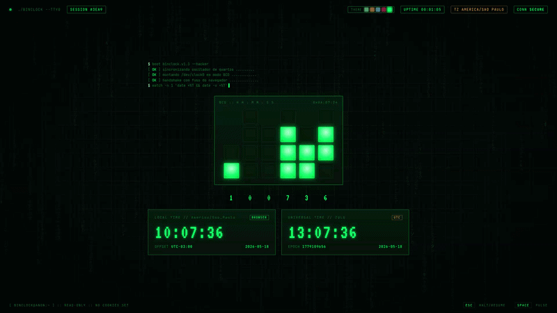

# Binary Clock 🕓



A visual binary clock with a "hacker terminal" theme built using HTML, CSS, and JavaScript.

Made with Claude Design.

## What it is 🚀

This project displays a binary clock showing local time in BCD (Binary-Coded Decimal), along with UTC time, date, and epoch readings.

It also includes:
- 🌧️ a lightweight Matrix-style rain background animation
- 🎨 selectable color themes
- 🖥️ a vintage terminal look with scanlines and CRT effects
- ⌨️ support for `ESC` to pause/resume and `SPACE` for a pulse animation

## How to use ▶️

Open the `index.html` file in a modern browser.

### Local development ✅

Run the local Python server from the project directory:

```bash
cd /home/marcus/Development/marcus/binary_clock
python3 app.py
```

Then open in your browser if it does not open automatically:

```text
http://localhost:8000/index.html
```

### Deploy on Vercel 🚀

This repository is configured as a static site for Vercel.
The deployment serves `index.html` directly, so no serverless function is required.

### Assets

The app loads icon and manifest assets from the `public/` folder, so keep that directory next to `index.html`.

## Keys ⌨️

- `ESC` — pause / resume the clock
- `SPACE` — pulse animation on the panel

## Themes 🎨

`main.html` offers five themes:
- phosphor
- amber
- ice
- blood
- matrix

## Compatibility 🌐

Works in modern browsers with support for HTML5, CSS custom properties, and ES6 JavaScript.
